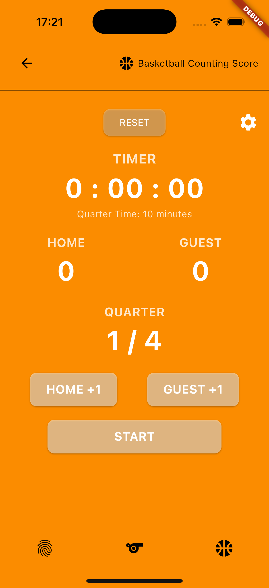

# flutter Application Tearm EDU Project

A new Flutter project to track and manage basketball game scores, with features for setting up game rules, viewing game statistics, and more.

## Getting Started

This project is a starting point for a Flutter application. It includes features such as a scoreboard, database management, and user interface built with Flutter’s Material Design components.

### Resources for Getting Started

- [Lab: Write your first Flutter app](https://docs.flutter.dev/get-started/codelab)
- [Cookbook: Useful Flutter samples](https://docs.flutter.dev/cookbook)

For help getting started with Flutter development, view the [online documentation](https://docs.flutter.dev/), which offers tutorials, samples, guidance on mobile development, and a full API reference.

---

## Database Table Structure

### `game_records.db`

| Field            | Type    | Description                            |
|------------------|---------|----------------------------------------|
| Id               | INTEGER | PRIMARY KEY AUTOINCREMENT              |
| home_team        | TEXT    | NOT NULL                               |
| guest_team       | TEXT    | NOT NULL                               |
| home_score       | INTEGER | NOT NULL                               |
| guest_score      | INTEGER | NOT NULL                               |
| quarter_number   | INTEGER | NOT NULL                               |
| quarter_minutes  | INTEGER | NOT NULL                               |
| total_quarters   | INTEGER | NOT NULL                               |
| formatted_date   | TEXT    | NOT NULL                               |

---

## Widgets Overview

- **MaterialApp**: Root widget of the app
- **Scaffold**: Basic structure of the screen including `AppBar`, `Body`, and `BottomNavigationBar`
- **AppBar**: Displays the top bar of the app (important)
- **SafeArea**: Prevents UI elements from overlapping with screen edges (important)
- **SingleChildScrollView**: Enables scrolling for content that overflows the screen (important)
- **Column**: Organizes content vertically
- **SizedBox**: Used for spacing (important)
- **_buildSportCard**: Individual sport cards (important)
- **BottomNavigationBar**: Navigation bar at the bottom
- **BottomNavigationBarItem**: Items with icons for Home, Dark/Light Mode, and Statistics
- **Image.asset**: Displays images in `_buildSportCard` (important)
- **Positioned**: Positions text within a `Stack`
- **TextButton**: Text-based buttons
- **Row**: Organizes content horizontally (important)
- **FutureBuilder**: Loads data asynchronously from the database
- **SnackBar**: Displays notifications
- **RefreshIndicator**: Allows pull-to-refresh functionality (important)
- **ListView.builder**: Displays data from the database (important)
- **FloatingActionButton**: Button to scroll to the top
- **ValueListenableBuilder**: Real-time updates for UI changes (important)

---

## Flutter Packages

- **`package:flutter/material.dart`**: For creating UI following Material Design (important)
- **`package:audioplayers/audioplayers.dart`**: For playing audio files (important)
- **`dart:async`**: For handling asynchronous tasks (e.g., Future, Stream)
- **`package:intl/intl.dart`**: For formatting dates and times (important)
- **`package:path/path.dart`**: For managing file paths (important)
- **`package:sqflite/sqflite.dart`**: For working with SQLite databases (important)

---

## File Descriptions

- **`main.dart`**: Calls `home_screen`
- **`basketball_screen.dart`**: Displays the basketball score control screen
- **`db_helper.dart`**: Interacts with `sqflite` to create, update, and insert data into the database
- **`game_records_screen.dart`**: Displays all the data stored in the database
- **`home_screen.dart`**: Shows buttons and containers for navigation to other screens
- **`News.dart`**: Displays basketball news
- **`RuleScoring.dart`**: Shows international basketball scoring rules
- **`Setting_Basketballscore.dart`**: Allows setting quarter and time quarter configurations
- **`TeamPlayer.dart`**: Displays team player positions in basketball

## Home Screen

  
  
   
  Home Screen With Dark/Light Theme

## Basketball Counting Score Screen

  
   
  Basketball Counting Score Screen. This page can Count Score Home Team and Guest Team, Timer, Quater Game

## Game Setting Screencreen

  
   
  Setting Time and Number of Quater Game

## Game Record Screencreen

  
   
    This Screen Can Show Old Score, Team Winner, Time, Quater ,This information preference From SQLite on the device.

## Other Screen

  
  
  
   

 